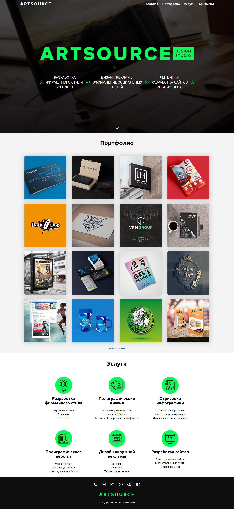

   

# Artsource

My friend's landing page implemented on Pug, SCSS and JS. This project is builded using Gulp task runner.



To view the full landing page [follow link](docs/landing-page-view.md).

# Feature

* The project is divided into Pug components and automatically builded into a single html file
* All images are minified, converted to base64 and included into a html file during build running
* All SCSS styles are converted to CSS, minified, merged into a single bundle and included into a html file during build running
* All JS scripts are converted using babel, minified, merged into a single bundle and are included into a html file during build running
* All page content (text, images, links) is stored in the JS files in the `src/data` and included into a html file during build running
* The repository have workflow, which deploys the project to a hosting by ssh for each `git push`
* The repository also have workflow, which publishes a release for each pushed tag by `git push origin v*`

# How to use it

Installs the project

```
git clone https://github.com/yurimikushov/artsource.git
cd artsource
npm i
```

Minifies a images in the `src/images/**` directory

```
npm run imagemin
```

Checks a follow CSS and SCSS writing conventions

```
npm run stylelint
```

Runs the project in `development` mode

```
npm run start
```

Builds the project for `production` to the `build` directory

```
npm run build
```

# License

The project is open source and available under the [MIT License](LICENSE).
